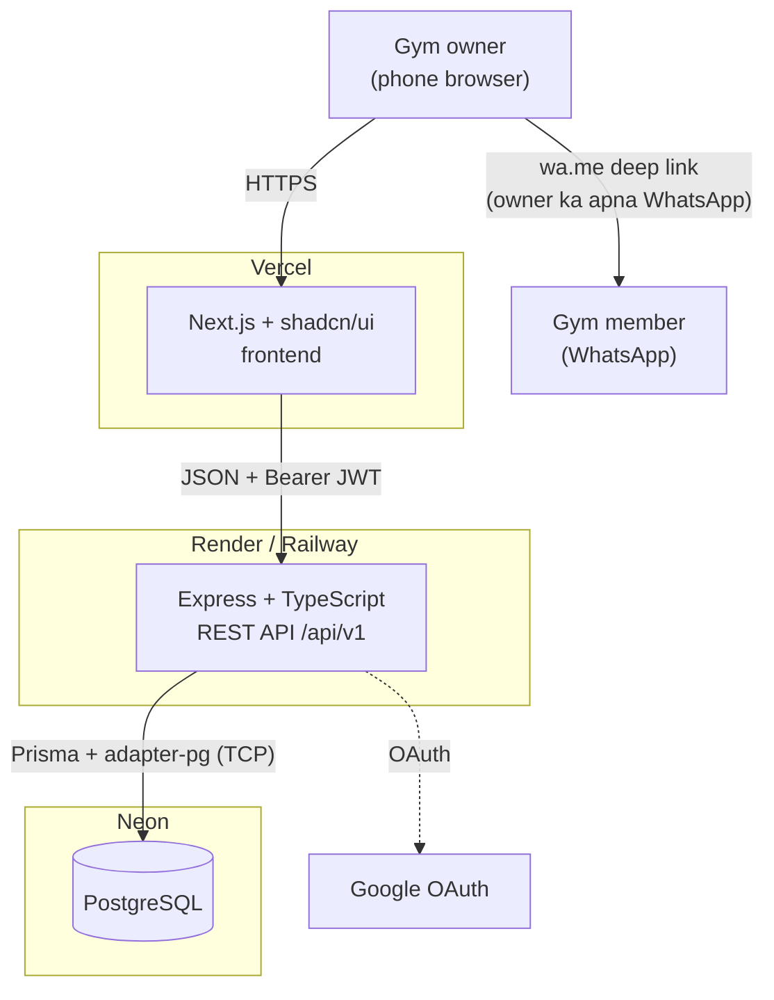
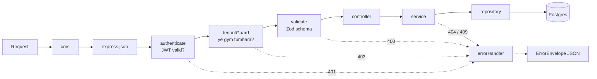
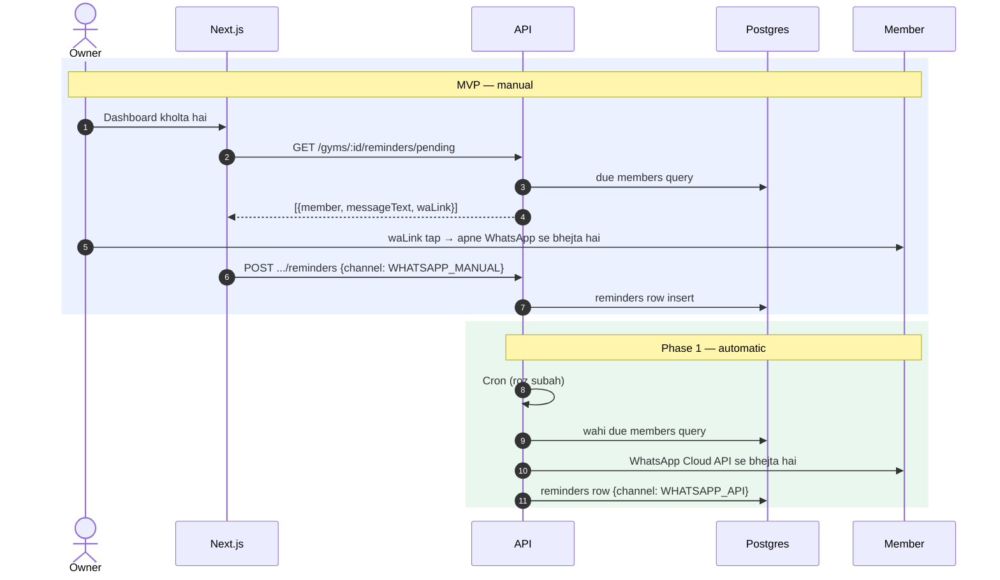
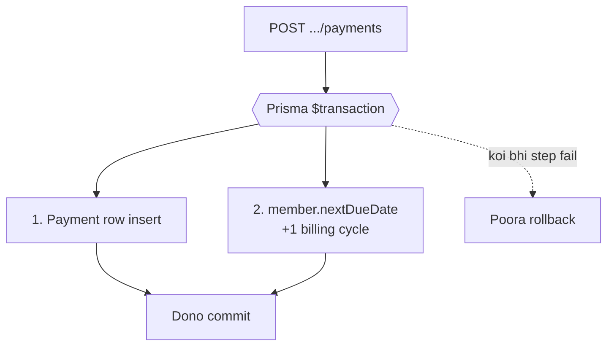

# Architecture

**Status:** Round 2 — MVP design
**Related:** [ADRs](./adr/README.md) · [schema.md](./schema.md) · [api-contract.md](./api-contract.md)

---

## 1. System context



**Dhyan dene wali baat:** MVP me reminder ka arrow **API se member tak nahi jata**. Server sirf `wa.me` link banata hai; message owner ke apne WhatsApp se jata hai. Ye deliberate hai — [ADR 007](./adr/007-manual-whatsapp-mvp.md).

---

## 2. Backend structure

[ADR 005](./adr/005-modular-architecture.md) ke hisaab se feature-based:

```
api/src/
  modules/
    auth/        auth.routes.ts   auth.controller.ts   auth.service.ts
    gyms/        gyms.routes.ts   gyms.controller.ts   gyms.service.ts
    members/     members.routes.ts  members.controller.ts
                 members.service.ts  members.repository.ts  members.validator.ts
    payments/    payments.routes.ts  payments.controller.ts  payments.service.ts
    reminders/   reminders.routes.ts reminders.controller.ts reminders.service.ts
    dashboard/   dashboard.routes.ts dashboard.controller.ts dashboard.service.ts
  shared/
    middlewares/  authenticate.ts  tenantGuard.ts  errorHandler.ts  validate.ts
    config/       env.ts  prisma.ts
    utils/        phone.ts  dates.ts  apiError.ts
  app.ts
  server.ts
```

### Layer responsibilities

| Layer | Kya karta hai | Kya NAHI karta |
|---|---|---|
| `routes` | URL → handler mapping, middleware chain | Koi logic nahi |
| `controller` | Request parse, service call, response format | Business rules nahi |
| `service` | **Saara business logic**, transactions | Direct `req`/`res` touch nahi |
| `repository` | Prisma queries | Business decisions nahi |
| `validator` | Zod schemas | — |

**Rule:** Service `req`/`res` nahi jaanti. Isse wo independently testable rehti hai aur kal koi cron ya CLI usi service ko call kar sakta hai — jo Phase 1 me exactly hoga.

---

## 3. Request lifecycle



`errorHandler` sabse aakhir me register hota hai. Har error usi se guzarta hai, isliye response shape har jagah ek jaisa rehta hai aur stack trace kabhi client tak nahi jata.

`tenantGuard` **router level** pe lagta hai, per-route nahi — matlab `/gyms/:gymId/*` ke neeche har route default se protected hai ([ADR 008](./adr/008-tenant-isolation.md)).

---

## 4. Reminder flow — MVP vs Phase 1

Yahi is architecture ka sabse important part hai: automation add karne pe contract nahi badalta.



Dono paths **same query, same table, same service** use karte hain. Farq sirf trigger (owner ka tap vs cron) aur transport (owner ka WhatsApp vs Cloud API) ka hai.

---

## 5. Critical invariant — payment aur due date



Agar ye do steps alag hue aur beech me fail hua:
- Payment bani, due date nahi badhi → owner phir se reminder bhejega jise paisa mil chuka hai
- Due date badhi, payment nahi bani → revenue history galat

Isliye ye logic **sirf `payments.service.ts`** me hai. Koi dusra module `nextDueDate` directly nahi chhuta. Detail: [schema.md §4](./schema.md).

---

## 6. Deployment

| Component | Host | Free tier ki dikkat |
|---|---|---|
| Next.js frontend | Vercel | — |
| Express API | Render / Railway | **15 min inactivity pe sleep** → ~30-50s cold start |
| PostgreSQL | Neon | Pooled connection string use karni hai |

Cold start MVP me tolerable hai (owner din me ek-do baar kholta hai), par jab paying customers aayenge to paid tier ya keep-alive ping chahiye. [ADR 001](./adr/001-separate-express-api.md) me ye trade-off record hai.

**Environment variables:** `api/.env.example` dekho. Prisma 7 `.env` khud load nahi karta — `prisma.config.ts` me `import "dotenv/config"` hai.

---

## 7. Abhi jaan-boojh kar nahi

| Cheez | Kab |
|---|---|
| Cron / job scheduler | Phase 1 — auto reminders ke saath |
| Redis / caching | Jab query slow ho, abhi 250 members max |
| Rate limiting | Traffic aane pe |
| Structured logging (pino) | Scaffold round me basic, aggregation baad me |
| CI/CD pipeline | Pehla deploy hone ke baad |
| Postgres RLS | [ADR 008](./adr/008-tenant-isolation.md) me reasoning — future reconsider |
