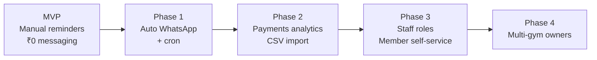

# Requirements

**Status:** Round 2 — MVP scope
**Related:** [architecture.md](./architecture.md) · [ADRs](./adr/README.md)

---

## 1. Problem

Chhote local gyms (₹400–700/month fees, ~60–250 members) me fee collection manual hai. Owner ko har member ko khud yaad dilana padta hai — call, WhatsApp, ya gym me aakar bolna. Isme do problems hain:

1. **Owner ka time aur awkwardness** — baar-baar paisa maangna padta hai, rishte kharab hote hain
2. **Revenue leak** — jo member bhool jata hai wo mahina skip kar deta hai; owner ko pata hi nahi chalta kaun due hai

Ek real gym owner (jahan developer khud jata hai, ₹400/month) ne confirm kiya ki wo aisa hi kuch dhoondh raha tha.

## 2. Users

| User | Kaun | Kya chahiye |
|---|---|---|
| **Gym owner** (primary) | 1 banda, phone se chalata hai, tech-savvy nahi | Pata chale kaun due hai, aur reminder bhejna aasan ho |
| **Gym member** (indirect) | App use nahi karta | WhatsApp pe time pe reminder mile |

**Constraint:** Owner **sirf phone** use karega. Laptop assume nahi karna.

---

## 3. Functional requirements — MVP

| # | Requirement | Priority |
|---|---|---|
| F1 | Owner Google se sign in kar sake | Must |
| F2 | Pehli baar login pe apna gym register kar sake | Must |
| F3 | Member add kare — naam, phone, fees, join date | Must |
| F4 | Members ki list dekhe, filter kare (overdue / due soon / upcoming), search kare | Must |
| F5 | Member edit kare, aur hataye (soft delete) | Must |
| F6 | Dashboard pe counts dekhe — total, due today, overdue, is mahine ka collection | Must |
| F7 | Due members ki list ke saath ready-made WhatsApp message aur link mile | Must |
| F8 | Reminder bhejne ke baad wo log ho jaye | Must |
| F9 | Member ko "paid" mark kare — payment record bane aur due date aage badhe | Must |
| F10 | Ek member ki payment history dekhe | Should |
| F11 | Reminder history dekhe (kise kab bheja) | Should |
| F12 | Gym settings badle (reminder kitne din pehle) | Should |

### Explicitly NOT in MVP

| Cheez | Kab | Kyun |
|---|---|---|
| Automatic WhatsApp reminders | Phase 1 | [ADR 007](./adr/007-manual-whatsapp-mvp.md) — pehle validate karna hai ki reminder kaam karta hai |
| Phone OTP login | Phase 1 | [ADR 006](./adr/006-google-signin-only.md) — DLT registration block |
| Member ka apna login | Phase 3 | Owner-only tool hai abhi |
| Attendance tracking | Out of scope | Ye fee reminder product hai |
| Online payment collection | Phase 2 | Cash/UPI offline hi chalta hai in gyms me |
| Staff / multiple users per gym | Phase 3 | Owner akela chalata hai |
| CSV bulk import | Phase 2 | Onboarding friction dikhne pe |
| Weekly/quarterly billing cycles | Phase 2 | Abhi monthly assume |

---

## 4. Non-functional requirements

| # | Requirement | Target | Kyun |
|---|---|---|---|
| N1 | **Mobile-first UI** | Har screen 360px pe kaam kare | Owner sirf phone use karega |
| N2 | **Tenant isolation** | Ek gym ka data dusre gym ko kabhi na dikhe | Sabse critical security boundary — [ADR 008](./adr/008-tenant-isolation.md) |
| N3 | Dashboard load | < 1s (cold start chhod ke) | Roz khulta hai |
| N4 | Scale | 100 gyms × 250 members = 25k members | Realistic 1-year ceiling |
| N5 | **Infra cost** | < ₹500/month at 5 gyms | Bootstrapped, koi revenue nahi abhi |
| N6 | Messaging cost | ₹0 in MVP | [ADR 007](./adr/007-manual-whatsapp-mvp.md) |
| N7 | Data durability | Payment records kabhi delete na hon | Business/audit record — soft delete only |
| N8 | Extensibility | Naya feature purane modules ko touch kiye bina | [ADR 005](./adr/005-modular-architecture.md) |

**N3 pe honest note:** Render free tier ka cold start ~30-50s hai. Wo N3 tod deta hai. MVP me accept kar rahe hain (owner din me 1-2 baar kholta hai); paying customers aane pe paid tier lena hoga.

---

## 5. Roadmap

| Phase | Trigger — kab shuru karna hai |
|---|---|
| **MVP** | Abhi |
| **Phase 1** | Jab 1 owner trial ke baad actually paisa de de |
| **Phase 2** | Jab 10+ gyms paying ho |
| **Phase 3** | Jab owner khud staff maange |
| **Phase 4** | Jab koi owner 2nd gym khole |

Schema aur API contract Phase 4 tak ke liye already design ho chuke hain (`gymId` tenancy, `Reminder.channel` enum) — un phases ke liye schema migration nahi chahiye.

---

## 6. Success criteria — MVP

Ye tab successful hai jab **sab** sach ho:

1. Ek real gym owner apne saare members khud enter kar de (bina developer ke)
2. Wo 1 mahina bina bole use kare
3. Us mahine me pehle se zyada members time pe pay karein
4. Trial ke baad wo ₹199/month dene ko taiyar ho — **bina zyada convince kiye**

Point 4 hi asli test hai. "Haan achha hai" free me sunna aasan hai; paisa dena alag baat hai.

**Agar point 4 fail ho:** Phase 1 mat banao. Pehle samjho ki value kahan kam padi — reminder kaam nahi kiya, ya kaam kiya par itna nahi ki paisa banta ho.
