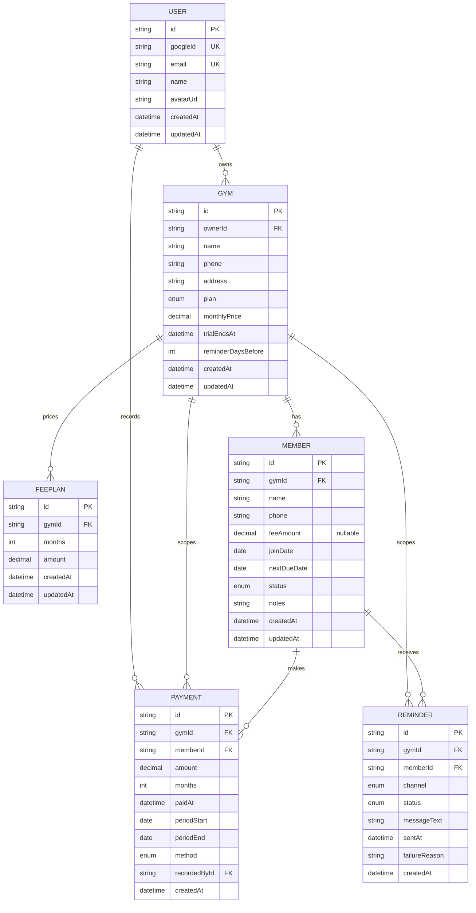

# Database Schema Design

**Status:** Round 1 — MVP schema
**Database:** PostgreSQL (Neon)
**ORM:** Prisma
**Source of truth:** [`api/prisma/schema.prisma`](../api/prisma/schema.prisma)

---

## 1. Domain overview

Ek **gym owner** (User) apna **gym** register karta hai. Gym me **members** hote hain, har member ki ek monthly fee aur ek next due date hoti hai. Jab member fees deta hai to ek **payment** record banta hai aur uski due date aage badh jati hai. Owner due members ko **reminders** bhejta hai.

MVP me reminder manual hai — system `wa.me` link banata hai, owner tap karke bhejta hai. Phase 1 me yahi automatic ho jayega (WhatsApp Cloud API + cron), **bina schema badle**.

---

## 2. ER Diagram



---

## 3. Design decisions

### 3.1 `Gym` ko `User` se alag entity rakha

**Decision:** Owner (User) aur Gym do alag tables hain. Har tenant-scoped table `gymId` carry karti hai, `userId` nahi.

**Kyun:** Agar members ko seedha `userId` se jodte, to Phase 4 (ek owner ke multiple gyms / franchise chains) ke liye poori schema migrate karni padti — har table pe FK badalna, saari queries badalna. Gym ko alag rakhne se wo feature sirf "ek aur Gym row" ban jata hai.

**Trade-off:** MVP me har owner ka ek hi gym hoga, to abhi ye ek extra join hai jiska turant fayda nahi. Ye deliberate hai — sabse mehngi migration wahi hoti hai jo tenancy model badalti hai, isliye wo cost pehle hi le li.

---

### 3.2 Multi-tenancy: har tenant table pe `gymId`

**Decision:** `Member`, `Payment`, `Reminder` — teeno pe `gymId` FK, aur har index `gymId` se shuru hota hai.

**Kyun:**
- **Isolation:** Har query automatically gym ke andar scoped hoti hai. Tenant guard middleware ek hi jagah check karta hai ki logged-in user us `gymId` ka owner hai — controller me repeat nahi hota, isliye naya endpoint likhte waqt isolation check bhoolna possible hi nahi.
- **Performance:** Composite index `(gymId, ...)` se har query pehle tenant pe narrow hoti hai, phir filter. Bina iske table scan poore database pe jata.

**Note:** `Payment` aur `Reminder` pe `gymId` technically redundant hai (`memberId` → `Member.gymId` se derive ho sakta hai). Deliberately denormalized rakha hai taaki gym-level queries (`GET /gyms/:id/payments`, analytics) ko join na karna pade, aur tenant guard uniform rahe.

---

### 3.3 `Member.nextDueDate` denormalized

**Decision:** Next due date `Member` pe ek column hai, `Payment` history se compute nahi hoti.

**Kyun:** Dashboard ki sabse zyada chalne wali query hai *"is gym me aaj kaun due hai"*. Denormalized column ke saath ye `@@index([gymId, nextDueDate])` pe ek index range scan hai. Derive karne wala approach har member ki latest payment nikaal ke, billing cycle add karke compare karta — har dashboard load pe aggregate query.

**Trade-off:** Ye ek **duplicated fact** hai — payment history aur `nextDueDate` theoretically diverge kar sakte hain. Isliye payment record karna aur `nextDueDate` advance karna **ek hi database transaction me** hota hai (dekho §4). Jab tak wo invariant code me ek hi jagah enforce hai, divergence possible nahi.

**Interview note:** Ye classic read-vs-write trade-off hai — read path fast kiya, write path pe ek extra update aur ek transactional invariant liya.

---

### 3.4 `Payment` table MVP me bhi

**Decision:** "Mark as paid" ek immutable `Payment` row banata hai, sirf member pe flag flip nahi karta.

**Kyun:**
- **Audit trail:** Kisne, kab, kitna, kaunse method se record kiya — dispute hone pe yahi proof hai ("bhai maine to de diye the").
- **Phase 2 analytics** (monthly collection, defaulter trends) bina schema change ke isi table pe ban jayegi.
- Boolean flag se history reconstruct karna impossible hai — wo information permanently lost hoti hai.

---

### 3.5 `Reminder` table MVP me bhi — future-proofing ka core

**Decision:** MVP me reminder manual hai, phir bhi har bheja gaya reminder log hota hai, `channel = WHATSAPP_MANUAL` ke saath.

**Kyun:** Yahi is schema ka sabse important design point hai. MVP aur Phase 1 me farq sirf itna hai:

| | MVP | Phase 1 |
|---|---|---|
| Trigger | Owner wa.me tap karta hai | Cron job |
| Sending | Owner ka apna WhatsApp | WhatsApp Cloud API |
| `channel` | `WHATSAPP_MANUAL` | `WHATSAPP_API` |
| Table | `reminders` | `reminders` — **same** |
| Schema change | — | **zero** |

Automation add karte waqt sirf `reminders.service.ts` ka andar ka code badlega. Schema, API contract, aur baaki modules untouched.

`messageText` isliye store hota hai kyunki template time ke saath badlega — history me wahi text dikhna chahiye jo actually bheja gaya tha, aaj ka template nahi.

---

### 3.5b Fee plans alag table me

**Decision:** Gym ke price tiers (1 month 400, 2 months 700, 3 months 1000) ek
alag `FeePlan` table me hain, `@@unique([gymId, months])` ke saath.

**Kyun:** Bundle discounted hota hai — 2 months ka 700 hai, 800 nahi. Matlab
amount `months x monthly rate` se derive **nahi** ho sakta; har tier owner ki
apni price hai, isliye store karni padti hai.

Ye tiers add-member aur payment screens pe quick-select buttons banate hain —
owner har baar do numbers type karne ke bajaye ek tap karta hai.

**Delete safe hai:** plan sirf figures bharne ka shortcut hai, kisi cheez ka
record nahi. Payment apna `amount` aur `months` khud store karti hai, isliye
plan hatane se history pe koi asar nahi.

---

### 3.5c `Member.feeAmount` nullable

**Decision:** Fee optional hai.

**Kyun:** Owner aksar member pehle add karta hai aur fees baad me tay karta ya
leta hai ("kuch log month complete hone pe dete hain"). Fee ko mandatory rakhne
se ya to galat number bharna padta, ya member add hi nahi hota.

**Consequence:** Jahan bhi fee se hisaab hota hai (pending amount, dashboard
total) wahan null handle karna padta hai — amount ke bajaye `null` lautaya
jata hai, 0 nahi, taaki "fees set nahi hai" aur "zero fees" alag dikhein.

---

### 3.5d `Payment.months`

**Decision:** Har payment record karti hai ki wo kitne mahine cover karti hai.

**Kyun:** Members ek saath kai mahine clear karte hain, aksar bundle rate pe.
Pehle due date hamesha ek mahina aage badhti thi — 2 mahine ka paisa lene pe bhi.
Ab wo `months` ke hisaab se badhti hai, aur `periodStart`/`periodEnd` poora
span cover karte hain.

---

### 3.6 Plan/settings `Gym` pe fields ke roop me

**Decision:** `plan`, `monthlyPrice`, `trialEndsAt`, `reminderDaysBefore` — Gym row pe.

**Kyun:** Pricing tiers (₹149 / ₹199 / ₹249 / ₹299 member-count ke hisaab se) aur trial periods **data** hain, code nahi. Kisi gym ka plan ya trial extend karna ek `UPDATE` hai — deploy nahi.

`reminderDaysBefore` per-gym isliye hai kyunki har owner ki preference alag hogi — koi 3 din pehle bolna chahega, koi 7.

**Aage kya:** Jab settings 8-10 se zyada ho jayein, alag `GymSettings` table ya ek `settings Json` column me shift karenge. Abhi 4 fields ke liye alag table premature hai.

---

### 3.7 Soft delete

**Decision:** Member delete karne pe `status = INACTIVE` set hota hai, row delete nahi hoti.

**Kyun:** Member ki payment history business record hai. Hard delete usse le dubega, aur past months ki collection reports galat ho jayengi. Members aate-jaate rehte hain — dobara join karne pe purani history bhi mil jati hai.

---

### 3.8 `Payment.recordedBy` pe `onDelete: Restrict`

**Decision:** Baaki saare relations `Cascade` hain, par `Payment → User (recordedBy)` `Restrict` hai.

**Kyun:** Financial records ko cascade delete ka silent side-effect nahi hona chahiye. Agar kabhi account deletion feature banega, wo ek deliberate flow hoga (records anonymize karo, ya export karke archive karo) — accidental cascade nahi. `Restrict` isko database level pe force karta hai.

---

### 3.9 Phone number E.164 me normalized

**Decision:** `Member.phone` bina `+` ke E.164 me store hota hai — `"919876543210"`.

**Kyun:** `wa.me/919876543210` link isi format ko expect karta hai. Agar raw input (`98765 43210`, `+91-98765-43210`) store karte, to har reminder banate waqt normalize karna padta — repeated logic, aur ek jagah bhoolne pe link toot jata. Normalization ek hi jagah hoti hai: input validation pe.

**`@@unique([gymId, phone])`** — ek gym me same number do baar add nahi ho sakta. Ye normalized storage ki wajah se hi reliably kaam karta hai.

---

## 4. Critical invariant: payment → due date

Ye is system ka sabse important business rule hai:

```
POST /gyms/:gymId/members/:memberId/payments
  ↓  (ek transaction me)
  1. Payment row insert karo
  2. member.nextDueDate ko ek billing cycle aage badhao
  ↓
  Dono saath, ya dono nahi.
```

Agar ye do steps alag hue aur beech me fail hua, to ya to paisa liya par member due hi dikhta rahega (owner phir se reminder bhejega — embarrassing), ya due date badh gayi par payment record nahi bana (revenue history galat).

Isliye ye logic **sirf** `payments.service.ts` me rahega, Prisma `$transaction` ke andar. Koi dusra module `nextDueDate` ko directly nahi chhuyega.

---

## 5. Indexes aur unka reason

| Index | Kaunsi query serve karta hai |
|---|---|
| `members (gymId, nextDueDate)` | **Core dashboard query** — due/overdue members list |
| `members (gymId, status)` | Active members count, active-only listing |
| `members (gymId, phone)` UNIQUE | Duplicate member prevention |
| `payments (gymId, paidAt)` | Monthly collection summary, gym-level history |
| `payments (memberId, paidAt)` | Ek member ki payment history |
| `reminders (gymId, createdAt)` | Gym-level reminder history |
| `reminders (memberId, createdAt)` | "Is member ko last reminder kab gaya" |
| `users.googleId` UNIQUE | Har login pe lookup |
| `users.email` UNIQUE | Duplicate account prevention |

---

## 6. Due-status derivation

Status stored nahi hai — `nextDueDate` aur gym ke `reminderDaysBefore` se runtime pe compute hota hai:

| Status | Condition |
|---|---|
| `overdue` | `nextDueDate < today` |
| `due_soon` | `today <= nextDueDate <= today + reminderDaysBefore` |
| `upcoming` | `nextDueDate > today + reminderDaysBefore` |

**Kyun store nahi kiya:** Ye time ke saath khud badalta hai. Store karte to ek daily cron chahiye hota sirf statuses refresh karne ke liye — aur wo cron fail hone pe poora dashboard galat dikhta. Derive karna hamesha correct hai.

---

---

## 6b. Arrears — pending ek span hai, ek date nahi

Ek member 3 mahine peeche ho to wo **3 mahine** ka bakaya rakhta hai, ek ka nahi.
Pehle sirf `nextDueDate` aur ek mahine ki fee dikhti thi, jo debt ko chhupa
deti thi.

Ab har overdue member ke liye derive hota hai:

| Field | Kaise |
|---|---|
| `pending.months` | Kitni due dates nikal chuki hain = `monthsElapsed(nextDueDate, today) + 1` |
| `pending.from` | `nextDueDate` — bakaya yahin se shuru hua |
| `pending.to` | `nextDueDate + months - 1 din` |
| `pending.amount` | `months x feeAmount`, ya `null` agar fee set nahi |

`+1` isliye hai ki jo due date nikal chuki hai wo khud bhi pending hai.
Misaal: due 20 Jun, aaj 4 Sep → 2 poore mahine beete, par Jun/Jul/Aug teeno ki
fees pending hai = 3.

**Dashboard ka `pendingAmount` bhi isi se banta hai.** Pehle wo overdue members
ke `feeAmount` ka SUM tha — matlab har member ka sirf ek mahina gina jata tha.

---

## 7. Abhi jaan-boojh kar nahi banaya

| Cheez | Kab |
|---|---|
| `GymStaff` / roles table | Phase 3 — jab multi-staff aayega |
| `MessageTemplate` table | Phase 1 — abhi template code me constant hai |
| `Subscription` / billing table | Phase 2 — abhi plan fields Gym pe kaafi hain |
| `Attendance` table | Out of scope — ye fee reminder product hai |
| Custom billing cycles (weekly/quarterly) | Phase 2 — abhi monthly assume hai |

---

## 8. Prisma 7 setup (v6 se alag hai)

Prisma 7 me do breaking changes hain jo is project ko directly affect karte hain:

**1. `datasource` me `url` nahi rehta.** Schema me sirf `provider` hai; connection URL `api/prisma.config.ts` me jaati hai:

```ts
// api/prisma.config.ts
import "dotenv/config";                    // Prisma 7 .env khud load NAHI karta
import { defineConfig, env } from "prisma/config";

export default defineConfig({
  schema: "prisma/schema.prisma",
  migrations: { path: "prisma/migrations" },
  datasource: { url: env("DATABASE_URL") },
});
```

**2. Generator badal gaya.** `prisma-client-js` ki jagah `prisma-client`, aur `output` ab **mandatory** hai — client `node_modules` me generate nahi hota:

```prisma
generator client {
  provider = "prisma-client"
  output   = "../generated/prisma"   // isko .gitignore me daalna hai
}
```

**3. Runtime pe driver adapter chahiye.** Prisma 7 me SQL databases ke liye native engine binary hat gaya hai — `PrismaClient` ko ek driver adapter dena padta hai.

Neon ke saath do options the:

| Adapter | Underlying driver | Kab |
|---|---|---|
| `@prisma/adapter-pg` | `pg` (standard TCP) | Long-running server |
| `@prisma/adapter-neon` | `@neondatabase/serverless` (WebSocket/HTTP) | Edge / serverless runtime |

**Choice: `@prisma/adapter-pg`.** Hamara backend ek long-running Express process hai (Render/Railway pe), edge function nahi. Wahan normal TCP connection pooling behtar kaam karta hai. `adapter-neon` tab zaroori hota hai jab runtime pe TCP available hi na ho — Vercel Edge, Cloudflare Workers. Ye humara case nahi hai.

### Version pinning

`prisma@latest` abhi **8.0.0-rc.12** hai — ek release candidate, aur uska CLI poori tarah alag hai (Developer Platform CLI; `validate`/`migrate` top-level pe hain hi nahi). Isliye `package.json` me **`prisma@^7.10.0`** pin kiya hai — yahi current stable hai (npm pe `prev` tag).

**Known advisory:** `npm audit` 4 high-severity issues dikhata hai, saare Prisma ki apni dependency tree se (`@prisma/config` → `deepmerge-ts`, aur `prisma` → `mysql2`). Ye dev-only hain (Prisma CLI devDependency hai) aur `mysql2` ka code path Postgres project me kabhi chalta hi nahi. Prisma ke deps bump karne ka intezaar — humara koi fix nahi hai.

---

## 9. Verification

```bash
cd api
npm install

# .env chahiye (ya env var export karo) — Prisma 7 me env resolution strict hai
cp .env.example .env    # phir DATABASE_URL bharo

npx prisma validate     # schema valid hai
npx prisma format       # formatting consistent
npx prisma migrate dev --name init
```

**Status:** `validate` aur `format` dono pass ho chuke hain Prisma 7.10.0 pe.
`migrate dev` abhi nahi chalaya — uske liye real Neon database chahiye.
